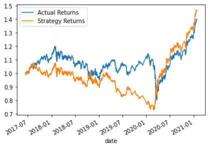

# Algorithmic_Trading_via_Machine_Learning

This Jupyter notebooks demonstrates the different ways machine learning models can be optimized or made differently by changing parameters or using a different kind of model, and how these differences may affect the result of a trading algorithm.
The notebook contains the creation of a basic trading algorithm along with the whole process of model, fit, predict, evaluate for SVM and Logistic Regression models for the scaled data.

Included is also an evaluation report of the models.

---

## Technologies

### Libraries:
* Pandas
* NumPy
* hvplot.pandas
* matplotlib.pyplot
* SVM from sklearn
* StandardScaler from sklearn.preprocessing
* DateOffset from pandas.tseries.offsets
* classification_report from sklearn.metrics
* LogisticRegression from sklearn.linear_model

The language of this notebook is Python on the Anaconda developement environment, worked upon on Jupyter Lab. The libraries used that come with Anaconda Python are Pandas, NumPy, matplotlib.pyplot, and sklearn.

HvPlot must be installed.

---

## Installation Guide

To install HvPlot, enter `conda install -c pyviz hvplot` into your terminal.

After, enter `conda list hvplot` to confirm installation of both.

---

## Usage

### Charts that compare the different models to the actual returns of their respective configurations:

#### First SVM Trail VS Actual Returns of Baseline Algorithm:

#### Second SVM Trail VS Actual Returns of Baseline Algorithm:

#### Third SVM Trail VS Actual Returns of Baseline Algorithm:

#### Logistic Regression VS Actual Returns of Baseline Algorithm:

All info is already input and worked on within the Jupyter file. Simply start from the top and go down the page to view relevant data, calculations, analysis, and notes.

---

## Results

* Support Vector Machine Model - 3-month Period - 4D & 100D SMAs:
  * Accuracy score: 55%
  * Precision score: Sell class - 43%, Buy class - 56%
  * Recall score: Sell class - 4%, Buy class - 96%

* Support Vector Machine Model - 24-month Period - 4D & 100D SMAs:
  * Accuracy score: 56%
  * Precision score: Sell class - 80%, Buy class - 56%
  * Recall score: Sell class - 0%, Buy class - 100%

* Support Vector Machine Model - 24-month Period - 50D & 100D SMAs:
  * Accuracy score: 56%
  * Precision score: Sell class - 0%, Buy class - 56%
  * Recall score: Sell class - 0%, Buy class - 100%

* Logistic Regression Model - 3-month Period - 4D & 100D SMAs:
  * Accuracy score: 52%
  * Precision score: Sell class - 44%, Buy class - 56%
  * Recall score: Sell class - 33%, Buy class - 66%

## Summary

At first, there was a simple algorithm created to buy and sell based on whether one SMA line was over another. When the first machine learning tool, Support Vector Machine (SVM), was used, it produced a great end result that ended about 10% higher than the actual returns.

In the second trial, of 24 months reatheer than 3 as the period, the portfolio value stayed the same as the actual return for the first few years, then took a better path, and ended at about 10% than the last trial, with 1% more accuracy at 56%.

In the third trial, with still a 24-month period and now a 50 day SMA and a 100 day instead of 4 & 100, accuracy remained higher, but the end cumulative return was less than trial 2. Thee sell precision and recall were both 0% meaning those classifications were at least all inaccurate.

The last trial, which used Logistic Regression, had the original SMA and period configurations, just a differeent type of model. It had the lowest accuracy of 52%, and was the only one of the others to actually end with a lower ROI than the actual returns, though still positive at about 20% growth.

Over all, the second SVM model was the most effective with the highest ROI.

## Contributor

Isaiah T Tensae